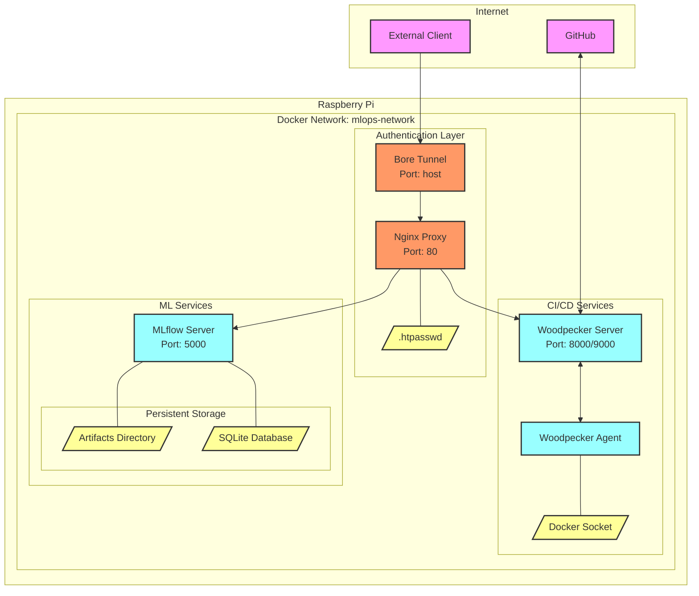

# Raspberry Pi MLOps Server

Use your raspberry PI for **free DevOps/MlOps infra** for your private and public Github projects.

A complete setup for running Woodpecker CI and MLflow on a Raspberry Pi, with secure tunneling and authentication.

## Overview

This project sets up:
- Woodpecker CI for continuous integration/deployment
- MLflow for ML experiment tracking
- Nginx reverse proxy with basic authentication
- Bore tunnel for secure external access
- Docker containers for all services

## System Architecture

Below is a detailed diagram of all services and their interactions:



### Architecture Components

1. **Authentication Layer**
   - Bore Tunnel: Creates a secure public endpoint for external access
   - Nginx Proxy: Handles routing and authentication
   - .htpasswd: Stores basic auth credentials

2. **CI/CD Services**
   - Woodpecker Server: Manages CI/CD pipelines
   - Woodpecker Agent: Executes CI/CD jobs
   - Docker Socket: Allows agent to create containers

3. **ML Services**
   - MLflow Server: Tracks experiments and models
   - Persistent Storage:
     - Artifacts Directory: Stores ML model files
     - SQLite Database: Stores experiment metadata

4. **External Connections**
   - GitHub: Integrates with Woodpecker for repositories
   - External Clients: Access services through bore tunnel

## Prerequisites

- Raspberry Pi 3 or newer
- Raspberry Pi OS (64-bit recommended)
- Internet connection
- GitHub account

## Installation

1. Clone this repository:
   ```bash
   git clone https://github.com/waddafunk/tiny_mlops.git
   cd tiny_mlops
   ```

2. Make scripts executable:
   ```bash
   chmod +x *.sh
   ```

3. Run the installation script:
   ```bash
   ./install.sh
   ```
   This will:
   - Install required packages (Docker, docker-compose, apache2-utils)
   - Set up Docker permissions
   - Create necessary directories
   - Generate basic auth credentials
   - Create initial environment files

4. Set up GitHub OAuth:
   - Go to GitHub Settings > Developer Settings > OAuth Apps
   - Create a new OAuth app
   - Wait for the bore tunnel URL from the next step before setting URLs

5. Start the services:
   ```bash
   ./start_services.sh
   ```
   This script will:
   - Generate new security secrets
   - Start the bore tunnel
   - Prompt for GitHub OAuth credentials
   - Configure the environment with the bore tunnel URL
   - Start all remaining services

6. Complete GitHub OAuth setup:
   - Return to your GitHub OAuth app settings
   - Set Homepage URL to your bore tunnel URL (http://bore.pub:XXXXX)
   - Set Authorization callback URL to http://bore.pub:XXXXX/authorize
   - Save the changes

## Services and Ports

- Woodpecker CI: Port 8000 (externally accessible via bore tunnel)
- MLflow: Port 5000 (locally accessible only)
- Nginx: Port 80 (handles routing and authentication)
- Bore Tunnel: Exposes services securely to the internet

## Security Features

- Basic authentication protects MLflow routes
- Automated secret generation for Woodpecker
- Secure cookie handling
- GitHub OAuth integration
- Local-only access for MLflow by default
- All services run in isolated Docker containers

## Configuration

### Environment Variables

The `.env` file is automatically generated and contains:
- `WOODPECKER_AGENT_SECRET`: Auto-generated secret for agent-server communication
- `WOODPECKER_COOKIE_SECRET`: Auto-generated secret for cookie encryption
- `WOODPECKER_HOST`: Automatically set to your bore tunnel URL
- `WOODPECKER_GITHUB_CLIENT`: Your GitHub OAuth client ID
- `WOODPECKER_GITHUB_SECRET`: Your GitHub OAuth client secret
- `WOODPECKER_ADMIN`: Your GitHub username

### Authentication

Basic auth credentials are generated during installation. To manage them:

```bash
./scripts/setup_auth.sh
```

This will either:
- Show existing credentials
- Generate new credentials if none exist
- Provide options for credential management

## Maintenance

### Viewing Logs
```bash
cd services
docker-compose logs -f
```

### Restarting Services
```bash
cd services
docker-compose down
docker-compose up -d
```

### Updating Services
```bash
cd services
docker-compose pull
docker-compose up -d
```

### Managing the Bore Tunnel
The bore tunnel automatically reconnects if disconnected. To get the current URL:
```bash
docker logs bore-tunnel
```

## Troubleshooting

1. **Docker Permission Issues**
   ```bash
   sudo usermod -aG docker $USER
   # Log out and log back in
   ```

2. **Service Access Issues**
   - Check if services are running: `docker-compose ps`
   - Verify bore tunnel URL: `docker logs bore-tunnel`
   - Check service logs: `docker-compose logs [service-name]`

3. **GitHub OAuth Issues**
   - Verify callback URL matches bore tunnel exactly
   - Check Woodpecker logs for OAuth errors
   - Ensure GitHub OAuth credentials are correctly set in `.env`

## File Structure
```
.
├── config/
│   └── nginx/
│       ├── auth/
│       │   └── .htpasswd
│       └── default.conf
├── mlflow/
│   ├── artifacts/
│   └── db/
├── services/
│   └── docker-compose.yml
├── scripts/
│   ├── setup_auth.sh
│   └── mount_smb_share.sh
├── install.sh
├── start_services.sh
└── .env
```

## Network Architecture

```
Internet <-> Bore Tunnel <-> Nginx Proxy <-> {Woodpecker CI, MLflow}
```

## Contributions

Contributions are welcome! Please submit pull requests for any improvements.

## License

[Add your license information here]